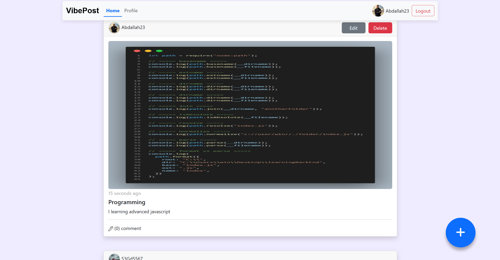

# 🚀 Vibe Posts

**Vibe Posts** is a simple social media web application built using  
**HTML, CSS, Bootstrap, and Vanilla JavaScript**, focusing on mastering **JavaScript fundamentals and API integration** without using any frameworks.

---

## 📸 Preview
[](https://vibeposts.netlify.app/home)

---

## 🌐 Live Demo
🔗 https://vibeposts.netlify.app/home

---

## 📖 Project Description
Vibe Posts is a lightweight social media platform that allows users to:

- Register and log in
- View daily posts
- Create, edit, and delete their own posts
- Comment on other users’ posts
- View other users’ profiles

The project simulates core social media functionality while keeping the codebase clean and framework-free.

---

## 🎯 Project Goals
- Practice working with **REST APIs**
- Master **Vanilla JavaScript** without frameworks
- Understand real-world CRUD operations
- Improve JavaScript logic and code organization

---

## 🛠 Tech Stack
- HTML5
- CSS3
- Bootstrap
- Vanilla JavaScript (ES6+)
- REST APIs

---

## ✨ Features
- User authentication
- Create, edit, and delete posts
- Comment system
- User profile pages
- Responsive UI using Bootstrap

---

## 🚀 Installation & Run Locally

Follow these steps to run the project locally on your machine:

1. Clone the repository from GitHub:
```bash
git clone https://github.com/Khodairy/vibePost.git
```


2. **Navigate to the project directory:**
```bash
cd vibePost
```

3. **Run the project:**
- Open `index.html` directly in your browser  
**or**  
- Open the project in **VS Code** and run it using the **Live Server** extension

> This project runs directly in the browser without any dependencies or build tools.

---

## 👤 Author
**Abdallah Khodairy**  
- Front-End Developer  
- GitHub: [@Khodairy](https://github.com/Khodairy)


